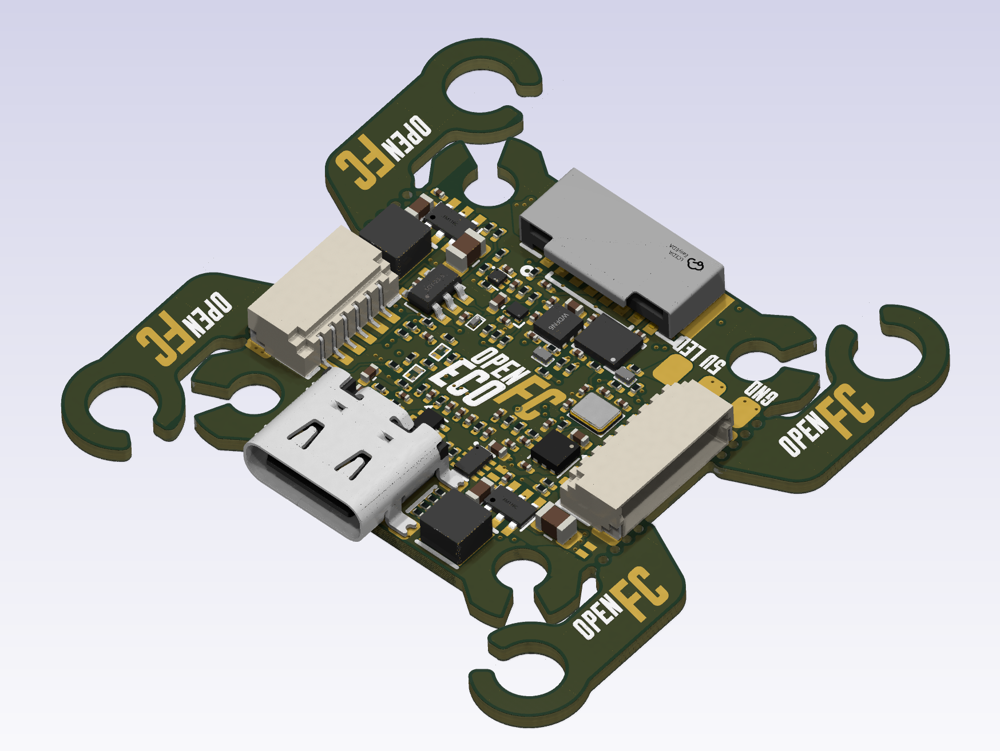

# OpenFC-ECO

Stripped-down variant of [OpenFC](https://github.com/Just4Stan/OpenFC) — open-source Betaflight flight controller based on the RP2354B microcontroller. Same core design, fewer peripherals, lower cost.

<p>


</p>

## Status

V0.3 boards have been received and brought up. Custom Betaflight target (`OPENFC_ECO_RP2350B`) builds and flashes; USB enumeration, IMU, SD card blackbox, and the switchable 10V VTX rail are all confirmed working on bench. Bring-up of motors, external RX, and the analog OSD chain is in progress. See [Known Issues](#known-issues--v04-fix-list) for V0.3 hardware bugs being addressed in V0.4.

## What's Different from OpenFC

| Feature | OpenFC | OpenFC-ECO |
|---------|--------|------------|
| MCU | RP2354B | RP2354B |
| IMU | LSM6DSV16XTR | **ICM-42688-P** (V0.3 was LSM6DSV16XTR — see HW-12 in plan) |
| Barometer | BMP388 | **Removed** |
| Blackbox | BY25Q128ASWIG (16 MB SPI flash) | **MicroSD card slot (TF-021B-H265)** |
| ELRS Receiver | ESP32-C3FH4 + SX1281 (break-off) | **Removed** — use external RX |
| Onboard WS2812B LEDs | 16× (4 corners) | **Removed** — LED strip pad only |
| Compass | LIS3MDLTR (DNP) | **Removed** |
| OSD | PIO-driven analog (sync-sep + opamp + mux) | PIO-driven analog (sync-sep + opamp + mux) |
| Power | 3S-6S, 10V/5V | 3S-6S, 10V/5V |
| Board | 30×30 mm, 6-layer | 30×30 mm, 6-layer |

## Specifications

### Core
- **MCU:** RP2354B — Raspberry Pi dual-core ARM Cortex-M33 @ 150 MHz, 2 MB integrated stacked flash, QFN-80
- **IMU:** ICM-42688-P — 6-axis MEMS, SPI, dedicated 1.8V LDO, 8 kHz ODR. (V0.3 prototype shipped with LSM6DSV16XTR; swapped to ICM-42688-P after the chip's ~25 kRPM MEMS resonance was identified as the cause of in-flight gyro saturation events on this airframe. ICM-42688-P is footprint-compatible — same LGA-14 2.5×3.0 mm pad layout, same SPI / INT / VDD pinout — so the V0.3 hardware works with either chip and the V0.4 PCB is unchanged below the IMU.)
- **Blackbox:** TF-021B-H265 microSD card slot on SPI1
- **USB:** USB-C, USB-CDC for configuration

### Power tree
| Rail | Source | Regulator | Notes |
|---|---|---|---|
| +10V (switchable) | +BATT | LMR51420YFDDCR (U6, 2A) | EN gated by GPIO11 (PINIO1). VTX/cam rail. Pin-compatible 3A drop-in: LMR51430YFDDCR. |
| +5V (always-on) | +BATT | LMR51420YFDDCR (U7, 2A) | Pin-compatible 3A drop-in: LMR51430YFDDCR. |
| +5V (USB/BATT mux) | +5V_BUCK + +5V_USB | TPS2116DRLR | Auto-selects active source. |
| +3.3V | +5V | LP5912-3.3DRVR | 500 mA LDO. |
| +1.8V (gyro analog) | +5V | NCV8187AMT180TAG | Isolated supply for IMU noise rejection. |
| +1.1V (MCU core) | +3.3V | RP2354B internal VREG | — |

### Motor outputs
- 4× PIO-driven DShot motor outputs (DShot600, bidirectional telemetry supported)
- M1=GPIO31, M2=GPIO30, M3=GPIO29, M4=GPIO28

### Connectors
- **USB-C** — configuration and firmware flashing
- **U1** — 6-pin SMD JST SH digital VTX connector (matches Betaflight standard: +10V/GND/TX/RX/GND/SBUS)
- **P1** — 8-pin TH JST SH ESC harness *(reversed pinout in V0.3 — must mirror in V0.4)*
- **J7/J8** — I2C0 expansion pads (SDA/SCL, with pull-ups to 3.3V)

### Serial / I/O
- **UART0** (GPIO0/1) — digital VTX / MSP DisplayPort
- **UART1** (GPIO22/21) — external serial RX (CRSF/SBUS/etc.)
- **PIO UART0** (GPIO2/3) — software UART, default GPS
- **PIO UART1** (GPIO26/27) — software UART, spare
- **I2C0** (GPIO16/17) — external expansion
- **SPI0** (GPIO18/19/20, CS=GPIO14, INT=GPIO13) — IMU
- **SPI1** (GPIO42/43/44, CS=GPIO46) — microSD blackbox

### Analog inputs
- VBAT sense (GPIO41) — 100k/10k divider, 11:1 ratio, 1k+100nF RC filter
- Current sense (GPIO40) — onboard sense circuit, 1k+100nF RC filter
- RSSI (GPIO45) — 1k+100nF RC filter
- External ADC (GPIO47) — 1k+100nF RC filter

### Additional
- Addressable LED strip output (GPIO23, PIO2)
- Status LED (GPIO12)
- Beeper output (GPIO6)
- 10V rail enable (GPIO11) — exposed as PINIO1/USER1 in firmware

### Analog OSD
- TLV3201AIDBVR — fast comparator, sync separator on incoming composite video
- TLV9061IDPWR — op-amp output buffer to camera signal
- SN74LVC1G3157DTBR — SPDT analog switch, selects between camera passthrough, black-pixel injection, and white-pixel injection
- Driven by RP2354B PIO2 — pixel-level timing for character overlay on PAL/NTSC composite

## Firmware

A custom Betaflight target lives in the [Betaflight config tree](https://github.com/betaflight/config) under `configs/OPENFC_ECO_RP2350B`:

- `FC_TARGET_MCU = RP2350B`
- `BOARD_NAME = OPENFC_ECO_RP2350B`
- `MANUFACTURER_ID = OPFC`
- Motor map mirrors the V0.3 hardware (M1..M4 = GPIO31..GPIO28)
- `USE_SDCARD_SPI` on SPI1 for blackbox
- `USE_PINIO` on GPIO11 for switchable 10V VTX rail
- FB_OSD framework wired but disabled by default (uncomment `ENABLE_FB_OSD` once the analog OSD chain is verified on hardware)

Build (requires a Betaflight checkout with `pico-sdk` and the BF-pinned ARM toolchain installed):

```sh
make picotool_install
make arm_sdk_install
make CONFIG=OPENFC_ECO_RP2350B
```

Output is a `.uf2` in `obj/`. Hold BOOTSEL on the board, plug in USB, drag the UF2 onto the `RP2350` mass-storage drive that mounts.

## PIO Allocation

The RP2350B has 3 PIO blocks × 4 state machines (12 total). OpenFC-ECO uses them as:

| Block | Function |
|---|---|
| PIO0 | DShot motor output (4 SMs, one per motor) |
| PIO1 | Software UART (PIO UART0 + PIO UART1 — TX and RX programs) |
| PIO2 | LED strip + analog OSD pixel timing |

## Known Issues / V0.4 Fix List

V0.3 hardware bugs being addressed in the next revision:

| ID | Component | Issue | Fix |
|---|---|---|---|
| HW-1 | C28 | 16V rated cap on +10V rail — severe DC bias derating, no transient headroom | 25V rated (e.g. CL10A226MQ8NRNC) |
| HW-2 | R30 | 6.8k feedback resistor produces 9.42V on +10V rail | 6.34k (E96), gives 10.06V |
| HW-3 | L2 | 4.7µH inductor undersized for +10V rail at 6S input (116% ripple) | 10µH (FTC303020D100MBCA) |
| HW-4 | D7 | LED0 is green; Betaflight manufacturer guidelines §3.1.4.6 require blue | Blue LED |
| HW-5 | U3/U4 | LMR51420YFDDCR (2A) — limited headroom | Drop-in upgrade to LMR51430YFDDCR (3A) |
| HW-6 | P1 | ESC connector pinout reversed vs Betaflight 8-pin standard, also missing telemetry pin | Mirror pinout, add telem pin |
| HW-7 | — | No battery reverse-polarity protection | Add PMOS RPP |
| HW-8 | U2 (NCV8187) | 300 mA gyro LDO; BF guidelines §3.1.2 recommend ≥500 mA | Upgrade to ≥500 mA LDO |
| HW-9 | — | LED strip pad only; consider adding standard onboard LEDs per BF spec | TBD |
| HW-10 | Board outline | 30×30 mm; BF stack standard is 30.5×30.5 mm | Bump to 30.5×30.5 |
| HW-11 | Beeper | Verify active buzzer + NPN driver topology per §3.1.4 | Audit |

The motor pin numbering issue (M1..M4 reversed vs the Betaflight `OPENFC_RP2350B` reference config) is **resolved in firmware** — the `OPENFC_ECO_RP2350B` Betaflight target maps motor pins to match the V0.3 silkscreen so no physical rework is needed.

## Repository Structure

```
OpenFC-ECO/
├── README.md
├── LICENSE
├── hardware/                ← KiCad 9 project, libraries, and production files
│   ├── OpenFC.kicad_pro     ← Project file
│   ├── OpenFC.kicad_pcb     ← PCB layout
│   ├── OpenFC.kicad_sch     ← Top-level schematic (hierarchical)
│   ├── *.kicad_sch          ← Sub-sheets
│   ├── lib.kicad_sym        ← Project-local symbol library
│   ├── lib.pretty/          ← Project-local footprint library
│   ├── lib.3dshapes/        ← Project-local 3D models
│   ├── production/          ← JLCPCB production exports per version
│   └── tools/               ← Analysis scripts (Python, kicad-skip / pcbnew API)
└── images/                  ← Board renders
```

All symbol, footprint, and 3D model libraries are project-local — no external library setup required.

## Schematic Hierarchy

- `OpenFC.kicad_sch` — top-level
- `rp2350a.kicad_sch` — RP2354B microcontroller and supporting circuitry
- `power.kicad_sch` — power supply and regulation (10V buck, 5V buck, 3.3V/1.8V LDOs, 5V mux)
- `imu.kicad_sch` — LSM6DSV16XTR IMU
- `osd.kicad_sch` — analog OSD chain (TLV3201 sync sep + TLV9061 buffer + SN74LVC1G3157 switch)
- `blackbox.kicad_sch` — TF-021B-H265 microSD card slot
- `pads.kicad_sch` — solder pads and connectors

## License

Hardware licensed under [CERN-OHL-S-2.0](https://ohwr.org/cern_ohl_s_v2.txt). See [LICENSE](LICENSE) for details.
